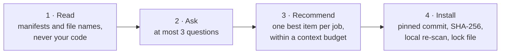
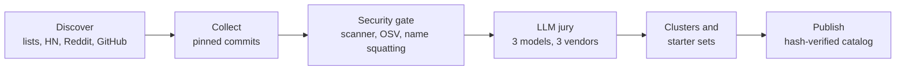

<p align="center"></p>

<p align="center">
  
  
  
  
  · <a href="README.tr.md">Türkçe</a> · <a href="README.zh-CN.md">简体中文</a>
</p>

> ## 🤖 For AI agents
>
> If the user asked you to set up Repotify for their project, run the published npm package (with provenance) in their project folder:
>
> ```
> npx -y @repotify/repotify@latest
> ```
>
> Then follow the `repotify` skill it installs into your skills folder (for example `.claude/skills/repotify/SKILL.md`, `.cursor/skills/repotify/SKILL.md` or `.agents/skills/repotify/SKILL.md`).
> Nothing beyond that skill is installed until the user approves it.

---

**Repotify picks a vetted, conflict-free set of agent skills, MCP servers and tools for *your* project, and installs them safely into Claude Code, Cursor, Codex or Gemini.** Think of it as a playlist for your coding agent: the right tracks for this repo, nothing that plays twice, and nothing that shouldn't be there.

**Works with** Claude Code · Cursor · Codex · Gemini CLI · any agent that reads `.agents/skills`

## Why

- **Too many choices.** A single discovery pass found 4,377 candidate repositories of agent skills. Which ones fit your project?
- **A real security risk.** A skill is a set of instructions your agent follows. A malicious one can run commands on your machine.
- **Context bloat.** Every skill takes room in the agent's context. Useless ones slow it down and distract it.

## Quick start

**Run it yourself** from your project folder:

```bash
npx -y @repotify/repotify@latest                        # installs the repotify skill, prints the project fingerprint
npx -y @repotify/repotify@latest recommend              # the candidate table
npx -y @repotify/repotify@latest install <ids…> --yes
```

**Or let your agent do it.** Ask Claude Code, Cursor, Codex or Gemini:

> Set up Repotify for this project: https://github.com/repotify/repotify

The agent reads the block above and does the rest: it reads your project, asks at most three questions, explains each pick and installs the set you approve.

To run from source instead: `git clone --depth 1 https://github.com/repotify/repotify ~/repotify`, then `node ~/repotify/bin/repotify.mjs`.

## See it in action

Real output on a Next.js SaaS project, trimmed to fit ([full walkthrough](docs/example-nextjs.md)):

```text
$ repotify
Detected agent: claude-code
Project fingerprint (local scan, code not read or sent):
- Stacks: docker, nextjs, node, react, typescript, vercel
- Tests: playwright, vitest | Data: prisma | LLM SDKs: openai
- Inferred needs: auth, ci, deploy, e2e-testing, frontend-ui, llm-calls, payments, testing

$ repotify recommend
Repotify candidates (★ = default set; context 4350/6000 chars)
★ test-driven-development | skill | tdd-discipline    | 0.73 | ✓💎 | core
★ react-best-practices    | skill | react-performance | 0.57 | ✓💎 | need:frontend-ui,stack:react,stack:nextjs
★ webapp-testing          | skill | webapp-testing    | 0.56 | ✓💎 | cap:webapp-testing,need:e2e-testing
★ context7                | mcp   | docs-lookup       | 0.42 | ✓   | cap:docs-lookup,need:llm-calls
· playwright-mcp          | mcp   | browser-automation| 0.42 | ✓   | cap:browser-automation,need:e2e-testing
  … 18 candidates in total, one per job

$ repotify install <default set> --yes
✓ test-driven-development
✓ react-best-practices
✓ repotify-guard → .claude/hooks/repotify-guard.mjs
✓ context7 → .mcp.json
• graphify (tool, run it yourself): 1) uv tool install graphifyy==0.9.71 2) graphify install
```

## How it works



1. **Knows your project without spending tokens.** A local script reads manifests and file names (never your code) and writes a ~400-token summary.
2. **Asks only what it cannot infer.** At most three multiple-choice questions, and only when the project does not already answer them.
3. **Picks from a vetted catalog.** Every item passed a rule-based security gate (plus an OSV advisory check for pinned packages). Every skill is also scored by a three-model LLM jury from three vendor families; tools and MCP servers are editorial picks. Items are clustered by capability so two items never do the same job.
4. **Lets your agent judge.** The agent reads a short candidate table (under 900 tokens), keeps the mandatory core, and writes one sentence per item: why it matters for *your* project.
5. **Installs safely.** Files come from a locked commit, are checked against catalog SHA-256 hashes, re-scanned on your machine, then written to your agent's folder and recorded in `repotify.lock.json`.

The whole flow costs your agent about 4,700 tokens.

## Supported agents

| Agent | Skills folder | MCP config |
|---|---|---|
| Claude Code | `.claude/skills/` | `.mcp.json` |
| Cursor | `.cursor/skills/` | `.cursor/mcp.json` |
| Codex | `.agents/skills/` | `.codex/config.toml` |
| Gemini CLI | `.gemini/skills/` | `.gemini/settings.json` |
| Any other agent | `.agents/skills/` | — |

The agent is detected automatically; override with `--agent claude-code,cursor,codex`.

## Commands

| Command | What it does |
|---|---|
| `repotify` | Installs the repotify skill for your agent and prints the project fingerprint |
| `repotify fingerprint` | Project summary (`--json` for machines) |
| `repotify questions` | Only the questions the fingerprint cannot answer |
| `repotify recommend` | Conflict-free candidate table (`--type`, `--needs`, `--priorities`, `--budget`, `--json`) |
| `repotify install <ids…> --yes` | Installs catalog items; caution items also need `--accept-caution` |
| `repotify remove <id>` | Removes something Repotify installed |
| `repotify update --check` | Lists catalog updates for what you installed; `--apply` installs scanned updates |
| `repotify scan <dir>` | Runs the security scanner on any skill folder |
| `repotify guard --hook` | Package guard used as a Claude Code hook |

## The mandatory core

Every project gets a small core that makes any agent more disciplined: a codebase knowledge graph (Graphify), the Superpowers discipline skills (brainstorming, writing plans, test-driven development, systematic debugging, verification before completion), a security review of every diff, and the **Repotify package guard**, which stops installs of packages that do not exist and asks before brand-new ones (a common attack on agents that invent package names).

## Security model

| Level | Meaning | What happens |
|---|---|---|
| `verified` | No known risky pattern | Recommended |
| `caution` | A finding worth a look | Shown with a badge, installed only with explicit consent |
| `quarantined` | High risk | Not recommended until a human reviews that exact commit |
| `rejected` | Critical risk | Removed from the catalog |

- A rule-based scanner decides trust. It reads shell commands the way a shell does (pipes, quotes, subshells, line continuations) and parses URLs the way curl does. It looks for remote code execution, credential access, data exfiltration, prompt injection aimed at agents or reviewers, hidden Unicode, obfuscated code, auto-running hooks, install scripts, destructive commands, binaries and symlinks.
- The LLM jury can only add suspicion, never raise trust.
- Third-party items are pinned to a commit and never update silently.
- Tools (for example Graphify) are never executed for you; Repotify shows the steps.
- Reports: [scanner results on real skills](docs/scan-corpus-report.md), [code reviews](docs/code-review-2026-09-28.md), [security audit](docs/security-audit.md). To report a problem, see [SECURITY.md](SECURITY.md).

## The catalog



The maintainers rebuild the catalog through this pipeline, and your client always reads the newest one (ETag-cached, with an offline copy in the package and rollback protection). Installed third-party items stay locked until you approve a scanned update. The package ships a hand-picked starter catalog; discovered items join when the catalog is rebuilt.

## By the numbers

| | |
|---|---|
| **300** | automated tests, on Node 18, 20 and 22 |
| **37 / 37** | deliberately malicious samples caught |
| **98.8%** | expected items recommended across 37 project scenarios |
| **1.6%** | false alarms on 127 real-world skills |
| **0** | runtime dependencies |

## Privacy

Repotify is designed to learn from anonymous signals (which items were shown, picked, kept after 7 days or removed, and votes). It never collects code, file names, repository names or user names, and never stores IP addresses. The collection endpoint is **not configured yet**, so nothing is sent; events only stay in a local queue. Opt out at any time with `REPOTIFY_TELEMETRY=0` or `DO_NOT_TRACK=1`.

## Official sources

The only official repository is [github.com/repotify/repotify](https://github.com/repotify/repotify). The npm package is published
as `@repotify/repotify` from this repository, with provenance; npm does not allow an unscoped `repotify` package.
Packages, forks or catalogs under other names are not affiliated; the agent block at the top of this page is the only
install instruction.

## Status

Preview (`0.1.0`), published on npm as `@repotify/repotify`. The CLI, the scanner, the installer for four agents, the package guard and the catalog pipeline work and are tested. Next: a larger catalog and anonymous analytics.

## Contributing

- **Know a great skill?** [Suggest it for the catalog](https://github.com/repotify/repotify/issues/new?template=catalog_submission.yml); it goes through the same security gate and jury.
- **Found a false alarm or a bug?** See [SUPPORT.md](SUPPORT.md). Security problems go to a private advisory ([SECURITY.md](SECURITY.md)).
- **Want to code?** Start with [CONTRIBUTING.md](CONTRIBUTING.md). What changed in each release: [CHANGELOG.md](CHANGELOG.md).

⭐ If Repotify kept a bad skill away from your agent, a star helps other developers find it.

## Development

Node.js 18 or newer, zero dependencies.

```bash
npm test          # unit, integration and end-to-end tests
npm run eval      # recommendation quality on the scenario set
```

The catalog pipeline lives in `pipeline/`; how to run and review it is in [docs/operations.md](docs/operations.md).

## License

MIT. Catalog items keep their own licenses and are installed from their source, never copied into this repository.

---

<p align="center">Built by <b>Ahmet Bilal Deniz</b> · <a href="https://github.com/repotify">@repotify</a></p>
