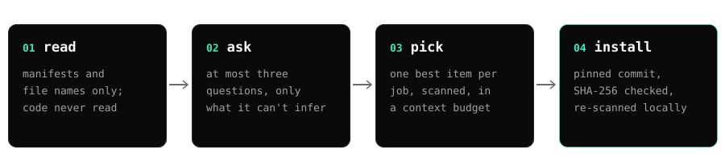

<p align="center"></p>

<h3 align="center">Thousands of agent skills. The right ones for your repo.</h3>

<p align="center">Repotify finds the agent skills developers publish on GitHub, vets each one for risk,<br>and installs the best picks for your project in Claude Code, Cursor, Codex or Gemini CLI.</p>

<p align="center">
  <a href="https://www.npmjs.com/package/@repotify/repotify"></a>
  <a href="https://github.com/repotify/repotify/actions/workflows/ci.yml"></a>
  
  <a href="LICENSE"></a>
</p>

> [!NOTE]
> **🤖 For AI agents.** If the user asked you to set up Repotify for their project, run the published npm package (with provenance) in their project folder: `npx -y @repotify/repotify@latest`. Then follow the `repotify` skill it installs into your skills folder (for example `.claude/skills/repotify/SKILL.md`, `.cursor/skills/repotify/SKILL.md` or `.agents/skills/repotify/SKILL.md`). Nothing beyond that skill is installed until the user approves it.

## Get started

In your project folder:

```bash
npx -y @repotify/repotify@latest
```

Or just tell your agent: **"Set up Repotify for this project: https://github.com/repotify/repotify"**

<p align="center"></p>

## How it works

<p align="center"></p>

1. **Read.** It looks at your manifests and file names. Your code is never read or sent anywhere.
2. **Ask.** At most three quick questions, and only what the project doesn't already answer.
3. **Pick.** One best skill, MCP server or tool per job, from a catalog where every item passed a security scan and every skill was reviewed by three AI models.
4. **Install.** Each skill comes from a pinned commit, is hash-checked and scanned again on your machine. Hooks and MCP servers stay off until you switch them on.

## The v2 pipeline

Behind `recommend` is a five-step pipeline that closes the loop — recommend → measure → learn:

1. **Test.** Every catalog candidate runs its own tests before it can be recommended.
2. **Classify.** A three-model jury scores quality and sorts items into capability classes.
3. **Map.** A deterministic capability graph (with "try this if that fails" fallback edges) finds the right tool for each job, so overlaps never happen.
4. **Narrow.** A question cascade — project signals first, learned preferences second, questions only as a last resort, ordered by information gain.
5. **Present.** A conflict-free skill set inside a context budget, with measured effectiveness scores where available.

Then Repotify measures: which skills were installed, invoked, kept after 7/30 days or removed, and your votes. A LinUCB bandit turns those anonymous signals into better rankings over time, and a fleet policy blends measurements across many developers into everyone's recommendations — see the telemetry policy below.

> [!NOTE]
> The v2 pipeline lives in `lib/pipeline/` and powers the `repotify recommend` command directly — fleet policy blending, opt-in Jev arbitration (`--arbitrate`), and Stage 0 propensity telemetry included.

## Telemetry policy

Repotify learns from anonymous usage signals, and you stay in control:

- **Default-ON with a notice.** The first time anything could be recorded, the CLI prints a notice on stderr. Nothing is measured before that.
- **Kill switches.** `repotify telemetry off` (persisted), `REPOTIFY_TELEMETRY=0`, or `DO_NOT_TRACK=1` turn it off; nothing is sent and nothing is written when disabled.
- **What is measured.** Which catalog items were shown, installed, invoked, kept after 7/30 days or removed, and your votes — plus a random install id and agent type. Never: code, prompts, file names, repository names, user names, transcripts or IP addresses.
- **Fleet learning.** Signals stay in a local queue. Only `repotify sync` sends anything, only anonymous aggregates, and only after you confirm on the terminal. The fleet server admits, snapshots, gates and distributes a shared policy with k-anonymity (at least 5 contributing syncs per published bucket, 24-hour quarantine). Published is the proof — which skills measure best at which jobs — never the recipe: raw data, taste profiles, scoring formulas and bandit weights stay private.

## Why Repotify

<table>
<tr>
<td width="33%" valign="top">

**Fits your project**<br>
Excel in your dependencies brings the spreadsheet skill, not Word and PowerPoint. A mobile app never gets web-only skills.

</td>
<td width="33%" valign="top">

**Nothing sketchy gets in**<br>
Every skill is read the way a shell and curl would read it, so known tricks like hidden downloads, credential grabs and prompt injection get caught.

</td>
<td width="33%" valign="top">

**No bloat**<br>
One item per job, inside a context budget. Your agent stays fast instead of carrying instructions it never uses.

</td>
</tr>
</table>

## By hand vs. Repotify

| | By hand | With Repotify |
|---|---|---|
| Finding skills | Dig through GitHub, read dozens of READMEs | Evidence-based picks for your stack |
| Checking trust | Skim install scripts and hope | Shell-aware scan plus an LLM jury |
| Fitting the project | Guess which ones apply | One pick per job, nothing overlapping |
| Staying lean | Context fills with unused instructions | Stays inside a context budget |

## Clean up what you already have

`repotify audit` looks at the skills already in your project and tells you which to keep and which to drop, with the reason. It never deletes anything.

<p align="center"></p>

## The website

[repotify.github.io/repotify](https://repotify.github.io/repotify/): 168 pages in 24 languages, one page per catalog item with public comments, and an effectiveness leaderboard ranked by measured evidence — no stars, no ratings.

## Commands

| Command | What it does |
|---|---|
| `repotify` | Reads your project and installs the repotify skill for your agent |
| `repotify recommend` | Shows the picks for this project |
| `repotify install <ids…> --yes` | Installs the skills you choose |
| `repotify enable <id>` | Switches on a hook or MCP server, after showing you the change |
| `repotify audit` | Judges the skills you already have |
| `repotify suggest` | Offers your own skill to the catalog |

Works with **Claude Code**, **Cursor**, **Codex**, **Gemini CLI** and any agent that reads `.agents/skills`. All commands, the security model and privacy: [docs/GUIDE.md](docs/GUIDE.md).

## Roadmap

- [x] Audit of installed skills, picks by evidence, Linux, macOS and Windows
- [x] Rankings that learn from what developers keep and remove (Stage 0 telemetry, LinUCB bandit, fleet policy)
- [x] Website with per-skill comments and an effectiveness leaderboard ranked by measured evidence
- [ ] A larger catalog of vetted skills, MCP servers and tools, found around the clock by an AI research lab (142 items from 24 repositories today)
- [ ] MCP mode: your agent calls Repotify as a tool

## Contributing

Wrote a great skill? Run `repotify suggest` in its repository. Found a bug or a false alarm? [Open an issue](https://github.com/repotify/repotify/issues). Want to code? Start with [CONTRIBUTING.md](.github/CONTRIBUTING.md).

---

<p align="center">⭐ If Repotify helped your agent, a star helps other developers find it.<br><sub>MIT license · <a href="https://repotify.github.io/repotify/">Website</a> · <a href="https://www.npmjs.com/package/@repotify/repotify">npm</a> · <a href="CHANGELOG.md">Changelog</a> · <a href=".github/SECURITY.md">Security</a> · <a href="docs/i18n/README.tr.md">Türkçe</a> · <a href="docs/i18n/README.zh-CN.md">简体中文</a></sub></p>
