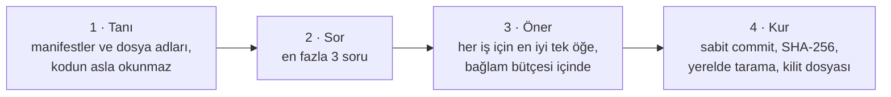
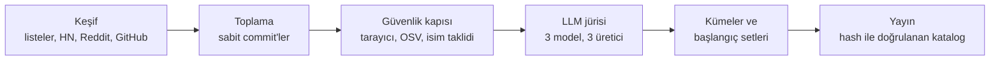

<p align="center"></p>

<p align="center"><a href="README.md">English</a> · <b>Türkçe</b> · <a href="README.zh-CN.md">简体中文</a></p>

> ## 🤖 Yapay zekâ ajanları için
>
> Depoyu klonla (`git clone --depth 1 https://github.com/repotify/repotify`), kullanıcının proje klasöründe
> `node repotify/bin/repotify.mjs` çalıştır ve kurduğu `repotify` skill'ini izle. `npx -y @repotify/repotify@latest` yalnızca paket
> bu deponun sahiplerince npm'de yayımlandıktan sonra kullanılmalı.

---

**Repotify, projene göre seçilmiş, güvenlik denetiminden geçmiş ve birbiriyle çakışmayan bir skill, MCP sunucusu ve araç seti hazırlar; bunları Claude Code, Cursor, Codex ya da Gemini'ye güvenle kurar.** Kodlama ajanın için bir çalma listesi gibi düşün: bu repoya uygun parçalar, iki kez çalan yok, olmaması gereken hiçbir şey yok.

**Çalıştığı ajanlar:** Claude Code · Cursor · Codex · Gemini CLI · `.agents/skills` okuyan her ajan

## Neden?

- **Çok fazla seçenek.** Tek bir keşif turunda 4.377 aday skill reposu bulundu. Hangisi senin projene uyar?
- **Gerçek bir güvenlik riski.** Skill, ajanın okuyup uyguladığı talimatlardır. Kötü niyetli bir skill bilgisayarında komut çalıştırabilir.
- **Şişen bağlam.** Her skill ajanın hafızasında yer kaplar. Gereksizleri onu yavaşlatır ve dağıtır.

## Hızlı başlangıç

**Ajanına yaptır.** Claude Code, Cursor, Codex ya da Gemini'ye şunu söyle:

> Bu proje için Repotify'ı kur: https://github.com/repotify/repotify

Ajan yukarıdaki bloğu okur ve gerisini yapar: projeni tanır, en fazla üç soru sorar, her seçimin gerekçesini yazar ve senin onayladığın seti kurar.

**Ya da kendin çalıştır** (proje klasöründe):

```bash
git clone --depth 1 https://github.com/repotify/repotify ~/repotify
node ~/repotify/bin/repotify.mjs              # repotify skill'ini kurar, proje özetini gösterir
node ~/repotify/bin/repotify.mjs recommend    # aday tablosu
node ~/repotify/bin/repotify.mjs install <id…> --yes
```

`npx @repotify/repotify`, npm paketi yayımlandıktan sonra çalışacak.

Bir Next.js projesindeki gerçek çıktının adım adım anlatımı: [docs/example-nextjs.md](docs/example-nextjs.md) (İngilizce).

## Nasıl çalışır



1. **Token harcamadan projeni tanır.** Yerel bir betik sadece manifestlere ve dosya adlarına bakar (kodun okunmaz, gönderilmez) ve ~400 token'lık bir özet yazar.
2. **Sadece bilemediğini sorar.** En fazla üç çoktan seçmeli soru; proje cevabı zaten veriyorsa hiç sormaz.
3. **Denetlenmiş katalogdan seçer.** Her öğe kurallı bir güvenlik kapısından (sabitlenmiş paketler için OSV açık kontrolüyle) geçer. Her skill ayrıca üç farklı üreticiden üç modelli bir LLM jürisiyle puanlanır; araçlar ve MCP sunucuları editoryal seçimdir. Öğeler yeteneğe göre kümelenir; aynı işi yapan iki öğe asla birlikte gelmez.
4. **Kararı ajana bırakır.** Ajan kısa aday tablosunu (900 token'ın altında) okur, zorunlu çekirdeği korur ve her öğe için "bu projede neden işe yarar" cümlesini yazar.
5. **Güvenle kurar.** Dosyalar kilitli bir commit'ten iner, katalogdaki SHA-256 özetleriyle karşılaştırılır, senin bilgisayarında yeniden taranır, ajanının klasörüne yazılır ve `repotify.lock.json` dosyasına kaydedilir.

Tüm akış ajanına yaklaşık 4.700 token'a mal olur.

## Desteklenen ajanlar

| Ajan | Skill klasörü | MCP ayarı |
|---|---|---|
| Claude Code | `.claude/skills/` | `.mcp.json` |
| Cursor | `.cursor/skills/` | `.cursor/mcp.json` |
| Codex | `.agents/skills/` | `.codex/config.toml` |
| Gemini CLI | `.gemini/skills/` | `.gemini/settings.json` |
| Diğer ajanlar | `.agents/skills/` | — |

Ajan otomatik algılanır; `--agent claude-code,cursor,codex` ile değiştirebilirsin.

## Komutlar

| Komut | Ne yapar |
|---|---|
| `repotify` | Ajanın için repotify skill'ini kurar ve proje özetini gösterir |
| `repotify fingerprint` | Proje özeti (makineler için `--json`) |
| `repotify questions` | Sadece proje özetinin cevaplayamadığı sorular |
| `repotify recommend` | Çakışmasız aday tablosu (`--type`, `--needs`, `--priorities`, `--budget`, `--json`) |
| `repotify install <id…> --yes` | Katalog öğelerini kurar; dikkat seviyesindekiler için `--accept-caution` da gerekir |
| `repotify remove <id>` | Repotify'ın kurduğu bir şeyi kaldırır |
| `repotify update --check` | Kurduklarının güncellemelerini listeler; `--apply` taranmış güncellemeleri kurar |
| `repotify scan <klasör>` | Güvenlik tarayıcısını herhangi bir skill klasöründe çalıştırır |
| `repotify guard --hook` | Claude Code kancası olarak paket bekçisi |

## Zorunlu çekirdek

Her projeye, ajanı daha disiplinli yapan küçük bir çekirdek önerilir:
- kod tabanı bilgi grafiği (Graphify);
- Superpowers disiplin skill'leri: beyin fırtınası, plan yazma, test güdümlü geliştirme, sistematik hata ayıklama ve bitirmeden önce doğrulama;
- her değişikliğin güvenlik incelemesi;
- **Repotify paket bekçisi:** var olmayan paketlerin kurulmasını durdurur, çok yeni paketlerde önce sorar. Bu, paket adı uyduran ajanlara karşı yaygın bir saldırıdır.

## Güvenlik modeli

| Seviye | Anlamı | Ne olur |
|---|---|---|
| `verified` (doğrulandı) | Bilinen riskli kalıp yok | Önerilir |
| `caution` (dikkat) | Bakılması gereken bir bulgu var | Rozetle gösterilir, ancak açık onayla kurulur |
| `quarantined` (karantina) | Yüksek risk | Bir insan o commit'i inceleyene kadar önerilmez |
| `rejected` (reddedildi) | Kritik risk | Katalogdan çıkarılır |

- **Güveni kurallı bir tarayıcı belirler.**
  - Kabuk komutlarını kabuğun okuduğu gibi okur: boru hatları, tırnaklar, alt kabuklar, satır devamları.
  - URL'leri curl'ün ayrıştırdığı gibi ayrıştırır.
  - Aradıkları: uzaktan kod çalıştırma, kimlik bilgisi okuma, veri sızdırma, ajana ya da değerlendiriciye yönelik talimat enjeksiyonu, görünmez Unicode karakterler, gizlenmiş kod, kendiliğinden çalışan kancalar, kurulum betikleri, yıkıcı komutlar, ikili dosyalar ve sembolik bağlar.
- **LLM jürisi güveni asla yükseltemez**, yalnızca şüphe ekleyebilir.
- **Üçüncü taraf öğeler bir commit'e sabitlenir** ve sessizce güncellenmez.
- **Araçlar (örneğin Graphify) senin yerine çalıştırılmaz**; Repotify adımları gösterir.
- **Raporlar:** [gerçek skill'lerde tarayıcı sonuçları](docs/scan-corpus-report.md), [kod incelemeleri](docs/code-review-2026-09-28.md), [güvenlik denetimi](docs/security-audit.md). Bir sorun bildirmek için [SECURITY.md](SECURITY.md).

## Katalog



Katalog bu hat üzerinden bakımcılar tarafından yeniden üretilir ve istemcin her zaman en yenisini okur. Bunun için ETag önbelleği, pakette çevrimdışı bir kopya ve eski sürüme dönüşe karşı koruma kullanılır. Kurulan üçüncü taraf öğeler, sen taranmış bir güncellemeyi onaylayana kadar kilitli kalır. Paket elle seçilmiş bir başlangıç kataloğuyla gelir; keşfedilen öğeler katalog yeniden üretildiğinde eklenir.

## Rakamlarla

| | |
|---|---|
| **300** | otomatik test; Node 18, 20 ve 22'de |
| **37 / 37** | kasıtlı hazırlanmış zararlı örnek yakalandı |
| **%98,8** | 37 proje senaryosunda beklenen öğelerin önerilme oranı |
| **%1,6** | 127 gerçek skill'de yanlış alarm |
| **0** | çalışma zamanı bağımlılığı |

## Gizlilik

Repotify anonim sinyallerden öğrenmek üzere tasarlandı: hangi öğelerin gösterildiği, seçildiği, 7 gün sonra tutulduğu ya da kaldırıldığı, ve oylar. Kod, dosya adı, repo adı ya da kullanıcı adı asla toplanmaz; IP adresi saklanmaz. Toplama uç noktası **henüz yapılandırılmadı**, bu yüzden hiçbir şey gönderilmiyor; olaylar yalnızca yerel bir kuyrukta kalır. Kapatmak için: `REPOTIFY_TELEMETRY=0` ya da `DO_NOT_TRACK=1`.

## Resmî kaynaklar

Tek resmî depo [github.com/repotify/repotify](https://github.com/repotify/repotify). npm paketi bu depodan, kaynağı
doğrulanabilir biçimde `@repotify/repotify` adıyla yayımlanır; npm kapsamsız (scope'suz) bir `repotify` paketine izin
vermiyor. Başka adlardaki paketler, çatallar ya da kataloglar bu projeyle
ilgili değildir; tek kurulum talimatı bu sayfanın başındaki ajan bloğudur.

## Durum

Önizleme (`0.1.1`). Komut satırı aracı, tarayıcı, dört ajan için kurulum, paket bekçisi ve katalog hattı çalışıyor ve test edildi. Sırada: npm yayını, daha büyük bir katalog ve anonim analitik.

## Katkı

- **Güzel bir skill mi biliyorsun?** [Kataloğa öner](https://github.com/repotify/repotify/issues/new?template=catalog_submission.yml); o da aynı güvenlik kapısından ve jüriden geçer.
- **Yanlış alarm ya da hata mı buldun?** [SUPPORT.md](SUPPORT.md) dosyasına bak. Güvenlik sorunları gizli bildirimle ([SECURITY.md](SECURITY.md)).
- **Kod yazmak mı istiyorsun?** [CONTRIBUTING.md](CONTRIBUTING.md) ile başla. Her sürümde ne değişti: [CHANGELOG.md](CHANGELOG.md).

⭐ Repotify ajanını kötü bir skill'den koruduysa, bir yıldız başka geliştiricilerin de onu bulmasını sağlar.

## Geliştirme

Node.js 18 veya üstü, sıfır bağımlılık.

```bash
npm test          # birim, entegrasyon ve uçtan uca testler
npm run eval      # senaryo setinde öneri kalitesi
```

Katalog hattı `pipeline/` klasöründe; nasıl çalıştırılıp inceleneceği [docs/operations.md](docs/operations.md) dosyasında.

## Lisans

MIT. Katalog öğeleri kendi lisanslarını korur ve kaynaklarından kurulur; bu depoya kopyalanmaz.

---

<p align="center">Geliştirici: <b>Ahmet Bilal Deniz</b> · <a href="https://github.com/repotify">@repotify</a></p>
