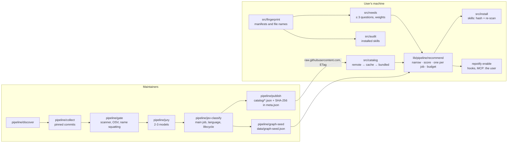

# Architecture

Repotify is a zero-dependency Node.js CLI plus a catalog pipeline. The CLI runs on the user's machine and never reads
source code; the pipeline runs on GitHub Actions (or a maintainer's machine) and publishes a static, hash-verified
catalog that every client downloads.

## Where things live

| Path | Responsibility |
|---|---|
| `bin/repotify.mjs` | Entry point: hands `process` streams to `src/cli.mjs` |
| `src/cli.mjs` | Argument parsing and every command's output (`start`, `fingerprint`, `questions`, `recommend`, `audit`, `suggest`, `install`, `enable`, `remove`, `scan`, `update`, `vote`, `telemetry`, `guard`) |
| `src/fingerprint.mjs`, `src/stackmap.mjs` | Local project scan: stacks, frameworks, needs, capability evidence, platforms, installed skills. `stackmap.mjs` is pure data |
| `src/needs.mjs` | The few questions an agent may ask, and needs with evidence weights |
| `lib/pipeline/recommend/` | The recommendation engine `recommend` runs (below): `narrow.mjs`, `score.mjs`, `present.mjs` (set, budget, candidate table), `index.mjs` (`demandFor`, `recommendLocal`, `recommendV1`) |
| `lib/pipeline/graph/`, `data/graph-seed.json` | The capability graph: which item does which job, plus curated requires / depends-on / conflicts / supersedes / fallback edges, each with a forcing test |
| `src/recommend.mjs` | Shared primitives (demand, fit, merit parts) used by the engine and by `audit`, and the table formatter; its own `recommend()` is the frozen v1 baseline the harness compares against |
| `lib/signals/jev.mjs` | Client for Jev-compatible decision models: the catalog classifier and the opt-in `--arbitrate` |
| `lib/telemetry/` | Local usage log (Stage 0), consent, privacy filter, `repotify sync` |
| `lib/learn/`, `lib/telemetry/server/` | The learning loop and fleet server: built and tested in simulation, not wired into `recommend`, not deployed |
| `src/catalog.mjs` | Catalog schema, integrity checks, loading with ETag cache, offline copy and rollback protection |
| `src/install.mjs`, `src/mcpconfig.mjs`, `src/lock.mjs` | Installs (pinned commit, SHA-256, local re-scan), MCP config per agent, `repotify.lock.json` |
| `src/agents.mjs` | Supported agents: skills folder, MCP config file, detection |
| `src/audit.mjs` | Judges installed skills: keep, consider removing, remove, with reasons |
| `src/suggest.mjs` | Builds a pre-filled catalog submission link for the user's own repository |
| `src/update.mjs` | Vetted updates for installed items; the optional weekly SessionStart check |
| `src/guard.mjs` | Package guard, a Claude Code PreToolUse hook. Node built-ins only: it is copied into projects as one file |
| `src/scan/` | Security scanner: `rules.mjs` (line rules), `shell.mjs` (shell structure), `files.mjs` (file-level rules), `typosquat.mjs` |
| `src/telemetry*.mjs`, `src/feedback.mjs` | Anonymous usage signals (endpoint off until deployed), weekly votes |
| `src/config.mjs`, `src/util.mjs`, `src/frontmatter.mjs` | URLs and settings, helpers, SKILL.md frontmatter |
| `pipeline/` | Discovery, collection, security gate, LLM jury, the Jev classifier (`jev-classify.mjs`, `classify-catalog.mjs`), the graph seed, publishing; `rehash.mjs` after a taxonomy edit, `regate.mjs` after a scanner change |
| `catalog/` | The published catalog. Generated; `meta.json` holds the hashes clients verify |
| `skill/repotify/SKILL.md` | The skill Repotify installs into the user's agent |
| `test/eval/` | Recommendation scenarios (`test/eval/scenarios/`), the scanner corpus run and the setup cost (`flow-tokens.mjs`) |
| `test/harness/` | Routing pilots and the gate's sensitivity sweep (run by `npm run check` and the catalog workflow) |
| `test/` | `node:test` suites, malicious and benign scanner fixtures, fixture projects |
| `pipeline/worker/` | Cloudflare Worker for anonymous analytics (not deployed yet) |
| `docs/` | Maintainer guide (`guides/`), reports (`reports/`), translations (`i18n/`) |
| `docs/examples/` | Worked examples with real output |
| `site/` | The website: `node site/build.mjs` builds one static page per language into `site/dist` (GitHub Pages) |

## The recommendation engine

`repotify recommend` runs `lib/pipeline/recommend` with no model call (Jev arbitration is opt-in and paid).

1. **Demand.** Needs come with a weight for how sure we are: seen in the project or said by the user (1.0), a stated
   priority (0.85), a default of the project type (0.75). Each need wants the capabilities the taxonomy maps it to.
   Dependency evidence narrows a broad need to the facets it shows: `openpyxl` means spreadsheets, not every office
   format, unless the user named the need. Platforms (web, mobile, desktop) come from dependencies.
2. **Narrow.** Candidates come from the capability graph (providers of each wanted job, fallbacks for blocked items)
   and from the catalog. Out, each with a reason code: blocked items, web-only skills for an app with no web target,
   items with no overlap with the demand, items written for stacks the project does not use, items already installed
   (in the lock or in an agent's skills folder) and anything that conflicts with an installed item.
3. **Score.** Fit times merit. Fit: one matched job is a full fit, stack experts need the stack, core items always
   fit; candidates below a fit of 0.2 are dropped. Merit: jury quality, trust (scan level), adoption, freshness and
   community signals, with Bayesian smoothing so new items are not punished.
4. **One item per job.** A cluster or exclusive group is served once: installed items keep theirs, core items claim
   theirs next, then the best item per job (a hand-vetted pick before a lab find). Declared conflicts drop the lower
   scorer.
5. **Coverage and budget.** An optional item needs a fit of 0.6 and must not be a near-duplicate of a chosen one
   (wanted-token Jaccard below 0.6); the set fills the context budget by value per token, after what is installed.
6. **Table.** The agent reads one row per job: installed items, the default set (★) and the best alternative for
   each open job, so anything it adds keeps the setup conflict-free. When the demand is too thin, the core backbone
   is offered with the reason, and the agent asks the questions from `repotify questions`.

`npm run eval` measures this on the scenario set; see [BENCHMARKS.md](BENCHMARKS.md).

## Trust boundaries

- **Reading is local.** The fingerprint reads manifests and file names, never file contents beyond manifests.
- **Skills are pinned and re-scanned.** Files come from the catalog's commit, must match its SHA-256 hashes and pass a
  local re-scan before they are written.
- **Hooks and MCP servers are the user's.** They change how the agent itself runs, so `install` only prints the
  `repotify enable <id>` command. `enable` shows the change and asks in a terminal; without one it needs `--yes`
  typed by the user. The skill tells agents never to run it. This is a guard rail, not a sandbox: an agent that ignores
  the skill could pass `--yes`, so the agent's own permission settings remain the real boundary.
- **Tools are never executed.** Repotify shows their steps.
- **The LLM jury can only lower trust.** Model output never makes an item safer.

## Design decisions

### Why JavaScript, not Python

Repotify serves people who use Claude Code, Cursor, Codex and Gemini CLI. Node.js is already on their machines (Claude
Code, Codex CLI and Gemini CLI install through npm), so `npx -y @repotify/repotify@latest` works with nothing to set up.
A Python tool needs `uv` or `pipx` first, which is the right trade for a tool like Graphify that needs heavy parsing
libraries (tree-sitter, graph algorithms). Repotify needs none of that: its work is file I/O, rules and scoring.

JavaScript also fits the artifacts Repotify writes: JSON settings, `.mcp.json` entries that launch npm packages with
`npx`, and a PreToolUse hook that must start fast and run with no dependencies. Node's standard library covers
everything else (`fetch`, `crypto`, `node:test`), which keeps the supply chain of a security tool at zero packages.

The costs are real but small: JavaScript regexes need care on long inputs (the scanner has a linear-time test) and the
code has no static types (tests and JSDoc cover it). A rewrite would cost weeks and give users nothing.

### Zero runtime dependencies

A tool that vets other people's code should not pull in a dependency tree of its own. Node built-ins only.

### A static catalog instead of a service

The catalog is plain JSON on GitHub with SHA-256 hashes in `meta.json`. Clients verify every file, cache by ETag, keep
an offline copy in the package and refuse a remote catalog older than the one they have. There is no server to trust or
to keep running.

## Changing things

| To add | Do this |
|---|---|
| A dependency or file signal | Add an entry to `src/stackmap.mjs` (`stacks`, `needs`, `caps`, `platforms`) and a fingerprint test |
| A capability, need or platform | Edit `catalog/taxonomy.json`, run `node pipeline/rehash.mjs`, add an eval scenario |
| A catalog item | Edit `pipeline/seed-sources.json` and rebuild (see [docs/guides/operations.md](guides/operations.md)) |
| A scanner rule | `src/scan/rules.mjs` plus a malicious and a benign fixture and a corpus run (see [CONTRIBUTING.md](../.github/CONTRIBUTING.md)) |
| A command | A module in `src/`, the command in `src/cli.mjs`, tests for its edge cases |
