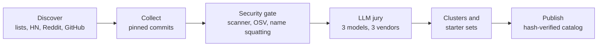

# Repotify in depth

The [README](../README.md) is the short version. This page has the details.

## How it works

1. **Knows your project without spending tokens.** A local script reads manifests and file names (never your code) and writes a ~400-token summary.
2. **Asks only what it cannot infer.** At most three multiple-choice questions, and only when the project does not already answer them.
3. **Picks from a vetted catalog, by evidence.** Every item passed a rule-based security gate (plus an OSV advisory check for pinned packages). Every skill is also scored by a three-model LLM jury from three vendor families; tools and MCP servers are editorial picks. Dependencies narrow broad needs, apps without a web target get no web-only skills, and an item joins the default set only if it covers something nothing else does.
4. **Lets your agent judge.** The agent reads a short candidate table (under 900 tokens), keeps the mandatory core, and writes one sentence per item: why it matters for *your* project.
5. **Installs safely.** Skill files come from a locked commit, are checked against catalog SHA-256 hashes, re-scanned on your machine, then written to your agent's folder and recorded in `repotify.lock.json`. Hooks and MCP servers change how your agent runs, so only you switch them on (`repotify enable`).

The whole flow costs your agent about 4,700 tokens.

## Security model

| Level | Meaning | What happens |
|---|---|---|
| `verified` | No known risky pattern | Recommended |
| `caution` | A finding worth a look | Shown with a badge, installed only with explicit consent |
| `quarantined` | High risk | Not recommended until a human reviews that exact commit |
| `rejected` | Critical risk | Removed from the catalog |

- A rule-based scanner decides trust. It reads shell commands the way a shell does (pipes, quotes, subshells, line continuations) and parses URLs the way curl does. It looks for remote code execution, credential access, data exfiltration, prompt injection aimed at agents or reviewers, hidden Unicode, obfuscated code, auto-running hooks, install scripts, destructive commands, binaries and symlinks.
- The LLM jury can only add suspicion, never raise trust.
- Third-party items are pinned to a commit and never update silently.
- Tools (for example Graphify) are never executed for you; Repotify shows the steps.
- Reports: [scanner results on real skills](reports/scan-corpus-report.md), [code reviews](reports/code-review-2026-09-28.md), [0.2.0 security review](reports/security-review-2026-09-30.md), [security audit](reports/security-audit.md). To report a problem, see [SECURITY.md](../.github/SECURITY.md).

## Supported agents

| Agent | Skills folder | MCP config |
|---|---|---|
| Claude Code | `.claude/skills/` | `.mcp.json` |
| Cursor | `.cursor/skills/` | `.cursor/mcp.json` |
| Codex | `.agents/skills/` | `.codex/config.toml` |
| Gemini CLI | `.gemini/skills/` | `.gemini/settings.json` |
| Any other agent | `.agents/skills/` | — |

The agent is detected automatically; override with `--agent claude-code,cursor,codex`.

## All commands

| Command | What it does |
|---|---|
| `repotify` | Installs the repotify skill for your agent and prints the project fingerprint |
| `repotify fingerprint` | Project summary (`--json` for machines) |
| `repotify questions` | Only the questions the fingerprint cannot answer |
| `repotify recommend` | Conflict-free candidate table (`--type`, `--needs`, `--priorities`, `--budget`, `--json`) |
| `repotify install <ids…> --yes` | Installs catalog skills; caution items also need `--accept-caution` |
| `repotify enable <ids…>` | Switches on a hook or MCP server after showing the change; for you, not your agent |
| `repotify audit` | Judges the skills already installed: keep, consider removing or remove, with the reason |
| `repotify suggest` | Offers your own skill or repository to the catalog: a pre-filled form, nothing is sent |
| `repotify remove <id>` | Removes something Repotify installed |
| `repotify update --check` | Lists catalog updates for what you installed; `--apply` installs scanned updates |
| `repotify scan <dir>` | Runs the security scanner on any skill folder |
| `repotify vote <id> up\|down` | Rates an item you installed (at most weekly) |
| `repotify telemetry status\|on\|off` | Anonymous usage signals; the endpoint is off, so nothing is sent |
| `repotify guard --self-test` | Checks the package guard; Claude Code runs `repotify guard --hook` itself |

## What Repotify changes on your machine

| Command | Writes |
|---|---|
| `repotify` | Your agent's `skills/repotify/` folder and `repotify.lock.json`; nothing else |
| `install` | Skill folders in your agent's skills directory, and the lock file |
| `enable` | Only what it shows you first: a hook in `.claude/settings.json` or an entry in your agent's MCP config |
| `recommend`, `audit`, `suggest`, `scan`, `fingerprint` | Nothing |

It reads manifests and file names, never your code. It downloads the catalog, and skill files at pinned commits;
tools are never executed for you. Repotify's flow never has your agent switch hooks or MCP servers on: `enable` asks
in a terminal (without one it needs `--yes`), and the skill tells agents to hand you the command instead of running it.
This is a guard rail, not a sandbox: your agent's own permission settings still decide what it may run.

## The mandatory core

Every project gets a small core that makes any agent more disciplined: a codebase knowledge graph (Graphify), the Superpowers discipline skills (brainstorming, writing plans, test-driven development, systematic debugging, verification before completion), a security review of every diff, and the **Repotify package guard**, which stops installs of packages that do not exist and asks before brand-new ones (a common attack on agents that invent package names). The guard is a hook, so you switch it on yourself with `repotify enable repotify-guard`.

## How the catalog is built



The maintainers rebuild the catalog through this pipeline, and your client always reads the newest one (ETag-cached, with an offline copy in the package and rollback protection). Installed third-party items stay locked until you approve a scanned update. The package ships a hand-picked starter catalog; discovered items join when the catalog is rebuilt.

## Privacy

Repotify is designed to learn from anonymous signals (which items were shown, picked, kept after 7 days or removed, and votes). It never collects code, file names, repository names or user names, and never stores IP addresses. The collection endpoint is **not configured yet**, so nothing is sent; events only stay in a local queue. Opt out at any time with `REPOTIFY_TELEMETRY=0` or `DO_NOT_TRACK=1`.

## Official sources

The only official repository is [github.com/repotify/repotify](https://github.com/repotify/repotify), and the website is
[repotify.github.io/repotify](https://repotify.github.io/repotify/) (built from `site/`). The npm package is published
as `@repotify/repotify` from this repository, with provenance; npm does not allow an unscoped `repotify` package.
Packages, forks or catalogs under other names are not affiliated; the agent block at the top of this page is the only
install instruction.

## Development

Node.js 18 or newer, zero dependencies.

```bash
npm test          # unit, integration and end-to-end tests
npm run eval      # recommendation quality on the scenario set
```

The catalog pipeline lives in `pipeline/`; how to run and review it is in [docs/guides/operations.md](guides/operations.md).
