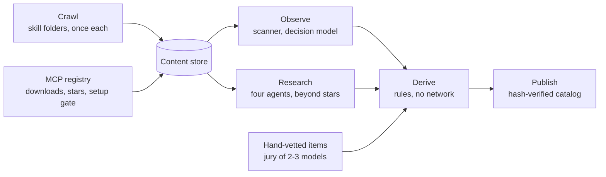

# Repotify in depth

The [README](../README.md) is the short version. This page has the details.

## How it works

1. **Knows your project without spending tokens.** A local script reads manifests and file names (never your code) and writes a ~400-token summary.
2. **Asks only what would change the picks.** Every possible answer is tried against the engine first; a question is listed only if an answer to it would change the default set, the likeliest decisive options first. At most three questions, each asked once, often none.
3. **Picks from a vetted catalog, by evidence.** Every item passed a rule-based security gate (plus an OSV advisory check for pinned packages). Every skill is also scored by an LLM jury of two or three models from different vendors; tools and MCP servers are editorial picks. Dependencies narrow broad needs, apps without a web target get no web-only skills, and the set holds one item per job; what the project already has keeps its job.
4. **Lets your agent judge.** The agent reads a short candidate table (under 900 tokens), keeps the mandatory core, and writes one sentence per item: why it matters for *your* project.
5. **Installs safely.** Skill files come from a locked commit, are checked against catalog SHA-256 hashes, re-scanned on your machine, then written to your agent's folder and recorded in `repotify.lock.json`. Hooks and MCP servers change how your agent runs, so only you switch them on (`repotify enable`).
6. **Keeps up.** Two hooks you can switch on: the tracker says when the project gained a stack or need that calls for a new pick, and the router points the agent at the installed skill that fits each request (see [After the install](#after-the-install)).

`repotify ui` shows all of this as a picture: the catalog as a tree on a local page, where each answer settles a branch and the picks stay lit.

The whole flow costs your agent about 3,000 tokens (measured on the fixture projects: `node test/eval/flow-tokens.mjs`).

## The v2 recommendation pipeline

Behind `recommend` (in `lib/pipeline/`) is a deterministic pipeline: no model calls on your machine. The catalog it reads is built in two ways: 93 hand-vetted items go through a jury of models, and everything else comes from a crawl kept in a content store.

1. **Fetch once** (`pipeline/crawl.mjs`, `pipeline/store.mjs`). Every skill folder of a repository is fetched once and kept by its SHA-256, with the repository's metadata. Nothing is downloaded twice, and what is stored is the raw material: scanning and judging happen later and can be redone without the network. MCP servers come from the official registry (`pipeline/mcp.mjs`): the ones that install locally from npm or PyPI, with their monthly downloads and their repository's stars.
2. **Observe** (`pipeline/observe.mjs`). The security scanner reads every file; a Jev-compatible decision model reads each `SKILL.md` and answers typed questions with probabilities: is it software work, its one main job, the language, framework or product it is for, whether it is tied to one product, what it is for (building the product, the agent's own work, running systems, content), how it pays off (once, every task, now and then) and how good it is. Each answer is stored under the content and the question set, so a new question set asks again and an unchanged one never does. Any Jev-compatible model works: set `JEV_ENDPOINT`, `JEV_MODEL` and `JEV_API_KEY`. The benchmark against 49 hand labels is in [BENCHMARKS.md](BENCHMARKS.md#the-classifier).
3. **Research** (`pipeline/research.mjs`). Four agents read what there is about a repository beyond its stars: forum threads (Hacker News, Reddit), its star history against installs, directories (skills.sh, Smithery) and curated lists. Their answers merge into a reputation with separate flags: stars that outrun every other signal are marked, and such a repository's skills wait for a human.
4. **Derive** (`pipeline/derive.mjs`). Rules turn the observations into catalog items: a permissive license, a clean or cautioned scan, confident answers, a job the catalog serves, a product scope a project can show, no copy of another repository's skill. A crawled item joins a default set only with evidence about itself: installs, or a well-regarded repository that names it among its best; for an MCP server, downloads and a starred repository. An MCP server must also start a server when run, and only the most used few for each job are listed. No network and no model: a changed rule rebuilds the catalog in seconds.
5. **Map.** A deterministic capability graph (`data/graph-seed.json`) for the hand-vetted items: PROVIDES edges are derived (`pipeline/graph-seed.mjs`), the rest (requires, depends-on, conflicts, supersedes, fallbacks) are curated. Every edge has a forcing-case test. Crawled items enter through their job.
6. **Narrow.** Project signals first; questions only when an answer would change the picks, at most three. Skills written for a stack the project does not use are out, and so is anything that conflicts with what is installed or was made for another agent; infrastructure and database skills need evidence (a Dockerfile or Terraform, a database client), not a project-type guess.
7. **Present.** One item per job (cluster), core backbone always, hand-vetted before vetted before crawled, optional items need a fit of 0.6, inside a context budget. An MCP server or tool whose runtime this computer lacks is listed with what it needs, not picked. Installed items (in the lock or already in an agent's skills folder) keep their job and their share of the budget. Score = fit × merit (quality, trust, adoption, freshness, community). The table the agent reads lists one row per job: installed items, the default set, and the best alternative for each open job.

The quality bar (`npm run eval`, 49 scenarios) runs this same engine, so a green eval means the sets users get are right.

Measurement and learning are built but not live: Stage 0 telemetry logs episodes locally, and a LinUCB learner with off-policy evaluation (`lib/learn/`) is tested in simulation. They are not wired into `recommend` and no collection server runs, so rankings do not learn yet; exploration is off unless `REPOTIFY_EXPLORE=1`.


## Locked product decisions (8-question package, 2026-10-01)

Approved product decisions and where they are enforced in code:

- **R1 (DL-035), revised 2026-10-02.** Coarse classification (three-model jury + keyword overlap) was not sufficient: measured against 49 hand labels the jury's main job was right 52% of the time, largely because the taxonomy had no slot for databases, DevOps or data/ML. The decision-model classifier (94%) now sets lab items' labels; the jury still scores quality.
- **R2 (DL-036).** An edge that was not exercised by a forcing test may never enter the capability graph. Enforced by `lib/pipeline/graph/loader.mjs` (`R2 violation` on `tested !== true` or a missing test reference), locked by `test/karar-r2.test.mjs`.
- **R4 (DL-037).** Usage signals (invoked, kept) never flow back into classification — they go to the bandit only (`oneShotLabel` → LinUCB). Classification reads the skill text and the jury's labels only (`pipeline/jev-classify.mjs` has no usage-signal input).
- **R6 (DL-038), revised 2026-10-02.** Curated edges in `data/graph-seed.json` stay frozen; PROVIDES edges are derived from the classified catalog (`pipeline/graph-seed.mjs`) so they cannot go stale when a skill is relabelled. Every edge, derived or curated, still needs its forcing test (R2).
- **Q5 (DL-039).** Taste profiles are project-scoped by default — every project gets its own profile. A user-global profile requires explicit opt-in. Consistent with the locked rule: never touch global installs.
- **DL-040.** The fleet taste-model turn-on threshold is deliberately NOT a fixed number; it will be set from Stage 0 telemetry data using offline policy evaluation (`lib/learn/ope.mjs`).
- **DL-041.** The leaderboard spec is approved: effectiveness is built from the one-shot label components (invoked, outcome, kept, removed, replaced), published with a 7-day delay, broken down by project type, reported as mean [min–max] with no stars or ratings.
- **DL-042.** Platform fallback weights for unobservable channels (e.g. `invoked`) are NOT fixed; they will be calibrated on Stage 0 data in the FAZ 11 OPE calibration harness. The locked rule stands: an unobserved channel is masked (recorded as unknown, never scored as 0).

## Security model

| Level | Meaning | What happens |
|---|---|---|
| `verified` | No known risky pattern | Recommended |
| `caution` | A finding worth a look | Shown with a badge, installed only with explicit consent |
| `quarantined` | High risk | Not recommended until a human reviews that exact commit |
| `rejected` | Critical risk | Removed from the catalog |

- A rule-based scanner decides trust. It reads shell commands the way a shell does (pipes, quotes, subshells, line continuations) and parses URLs the way curl does. It looks for remote code execution, credential access, data exfiltration, prompt injection aimed at agents or reviewers, hidden Unicode, obfuscated code, auto-running hooks, install scripts, destructive commands, binaries and symlinks.
- The LLM jury can only add suspicion, never raise trust.
- Third-party items are pinned to a commit and never update silently.
- Tools (for example Graphify) are never executed for you; Repotify shows the steps.
- Reports: [scanner results on real skills](reports/scan-corpus-report.md), [code reviews](reports/code-review-2026-09-28.md), [0.2.0 security review](reports/security-review-2026-09-30.md), [security audit](reports/security-audit.md). To report a problem, see [SECURITY.md](../.github/SECURITY.md).

## Supported agents

| Agent | Skills folder | MCP config |
|---|---|---|
| Claude Code | `.claude/skills/` | `.mcp.json` |
| Cursor | `.cursor/skills/` | `.cursor/mcp.json` |
| Codex | `.agents/skills/` | `.codex/config.toml` |
| Gemini CLI | `.gemini/skills/` | `.gemini/settings.json` |
| Any other agent | `.agents/skills/` | — |

The agent is detected automatically; override with `--agent claude-code,cursor,codex`.

## All commands

| Command | What it does |
|---|---|
| `repotify` | Installs the repotify skill for your agent and prints the project fingerprint |
| `repotify fingerprint` | Project summary (`--json` for machines) |
| `repotify questions` | Only the questions whose answer would change the picks, most decisive first; each is asked once (takes the answers given so far: `--type`, `--needs`, …) |
| `repotify recommend` | Conflict-free candidate table (`--type`, `--needs`, `--priorities`, `--stacks`, `--platforms`, `--budget`, `--json`) |
| `repotify ui` | Shows the decision as a tree in your browser: what the files rule in, what each answer settles, what gets picked. Local and read-only (`--port`) |
| `repotify install <ids…> --yes` | Installs catalog skills; caution items also need `--accept-caution` |
| `repotify enable <ids…>` | Switches on a hook or MCP server after showing the change; for you, not your agent |
| `repotify audit` | Judges the skills already installed: keep, consider removing or remove, with the reason |
| `repotify suggest` | Offers your own skill or repository to the catalog: a pre-filled form, nothing is sent |
| `repotify remove <id>` | Removes something Repotify installed |
| `repotify update --check` | Lists catalog updates for what you installed; `--apply` installs scanned updates |
| `repotify track` | Says what the project gained since the last look and which new picks fit it now; the tracker hook runs it when a session starts |
| `repotify scan <dir>` | Runs the security scanner on any skill folder |
| `repotify vote <id> up\|down` | Rates an item you installed (at most weekly) |
| `repotify telemetry status\|on\|off` | Anonymous usage signals, default-ON with a first-run notice; queued locally until you `sync`; kill switches: `telemetry off`, `REPOTIFY_TELEMETRY=0`, `DO_NOT_TRACK=1` |
| `repotify sync` | Sends an anonymous aggregate summary to a fleet server you configure (`REPOTIFY_TELEMETRY_URL`; none runs yet) — only aggregates, and only after you confirm on the terminal |
| `repotify guard --self-test` | Checks the package guard; Claude Code runs `repotify guard --hook` itself |

## What Repotify changes on your machine

| Command | Writes |
|---|---|
| `repotify` | Your agent's `skills/repotify/` folder and `repotify.lock.json`; nothing else |
| `install` | Skill folders in your agent's skills directory, and the lock file |
| `enable` | Only what it shows you first: a hook in `.claude/settings.json` (the router and the guard also add one file under `.claude/hooks/`) or an entry in your agent's MCP config |
| `recommend`, `questions`, `ui`, `track`, `audit`, `suggest`, `scan`, `fingerprint` | Nothing in your project |

Outside the project Repotify keeps one folder, `~/.repotify` (or `REPOTIFY_HOME`): the catalog cache, your settings, what the tracker last saw of each project (its stacks and needs, never code) and, while telemetry is on, the local usage log.

It reads manifests and file names, never your code. It downloads the catalog, and skill files at pinned commits;
tools are never executed for you. Repotify's flow never has your agent switch hooks or MCP servers on: `enable` asks
in a terminal (without one it needs `--yes`), and the skill tells agents to hand you the command instead of running it.
This is a guard rail, not a sandbox: your agent's own permission settings still decide what it may run.

## The mandatory core

Every project gets a small core that makes any agent more disciplined: a codebase knowledge graph (Graphify), the Superpowers discipline skills (brainstorming, writing plans, test-driven development, systematic debugging, verification before completion), a security review of every diff, and Repotify's three hooks. Hooks change how your agent runs, so you switch them on yourself: `repotify enable repotify-guard repotify-tracker repotify-router`. They are Claude Code hooks; when another agent is the one asking, they are not offered.

- **The package guard** stops installs of packages that do not exist and asks before brand-new ones (a common attack on agents that invent package names).
- **The tracker** and **the router** are described next.

## After the install

**The tracker** runs when a session starts (`repotify track --hook`). It remembers the stacks, needs and platforms your project's files showed last time, on your computer and outside the project (`~/.repotify/projects/`, no code, no file names). When the project gains something that brings a new pick, it says so once, in one line your agent reads: what is new, which picks it would add, and to run `repotify recommend`. Once a week it also runs the update check and names installed skills that no longer earn their place. When nothing changed it prints nothing.

**The router** runs before each request (`.claude/hooks/repotify-router.mjs`, one file with no dependencies). It reads the names and descriptions of the installed skills, and for skills Repotify installed the job the catalog gave them (recorded in `repotify.lock.json`). It then works out what kind of work the request is, in English or Turkish, from its words and its symptoms ("crashes", "404", "used to work"), and names up to three installed skills made for that kind of work, with one instruction: decide for each whether it applies. When nothing fits it prints nothing. Only skill names reach the agent's context, never a skill's own text. It takes about a tenth of a second and sends nothing anywhere. How well it does is measured in [BENCHMARKS.md](BENCHMARKS.md#the-skill-router).

**The audit** (`repotify audit`) also reads the MCP servers your agents have configured (`.mcp.json`, `.cursor/mcp.json`, `.codex/config.toml`, `.gemini/settings.json`): a server whose command fails the security scan is marked for removal; one that is not pinned to a version, or whose config holds a secret, is marked for review. The audit names the variable that holds a secret, never its value, and changes nothing.

## How the catalog is built



The maintainers rebuild the catalog through this pipeline, and your client always reads the newest one (ETag-cached, with an offline copy in the package and rollback protection). Installed third-party items stay locked until you approve a scanned update. The package ships a copy of the catalog for offline use.

What the current catalog was built from (2026-10-03): 4,651 skill folders from 54 repositories, of which 431 passed the rules; 2,613 MCP servers with at least 1,000 downloads a month, of which 24 are listed; 93 hand-vetted items. What kept the rest out, most common first: not software work (1,198 skills), no single clear job (640), tied to a product a project cannot show (529), a repository popular only by its stars (471, waiting for a human), kept in a repository's own agent folder (341), the security scan (327). For MCP servers: too little use to list (2,371).

## Privacy

Repotify learns from anonymous usage signals, and you stay in control.

- **Default-ON with a notice.** The first time anything could be recorded, the CLI prints this on stderr — nothing is measured before it:

  > Repotify measures which skills actually work and shares anonymous usage counts to improve recommendations. Turn off any time: `repotify telemetry off`.

- **Kill switches.** `repotify telemetry off` (persisted in config), `REPOTIFY_TELEMETRY=0`, `DO_NOT_TRACK=1` — and `NO_ANALYTICS=1` is honored too. When disabled, nothing is recorded and nothing is sent; the off command itself produces no telemetry.
- **What is measured.** A random install id, agent type, which catalog items were shown, installed, invoked, kept after 7/30 days or removed, and your votes. Events are validated as reward-agnostic: reward/score/weight fields are rejected, so the client can never fabricate outcomes.
- **What is never collected.** Code, prompts, transcripts, file names, repository names, user names, IP addresses. The server schema has no install_id, nonce or IP columns — this is locked by tests.
- **Fleet learning.** Signals stay in a local queue. Only `repotify sync` sends anything: anonymous aggregates, and only after you confirm on the terminal. The fleet server runs a nightly job (admit → snapshot → policy → gate → distribute) with k-anonymity (a skill's aggregate is published only when at least 5 distinct syncs contributed; 24-hour quarantine before counts influence public aggregates) and the public leaderboard stays gated behind 200 cumulative installs. Published is the proof — which skills measure best at which jobs — never the recipe: raw data, taste profiles, scoring formulas and bandit weights stay private.

## The website

The official site ([repotify.github.io/repotify](https://repotify.github.io/repotify/), built from `site/`) is generated statically in 24 languages, with a page per catalog item and no trackers. Each catalog item gets a page with public comments (moderation controls only behind `?demo=moderation`, never on public pages). The [effectiveness leaderboard](https://repotify.github.io/repotify/leaderboard/) ranks routing strategies by measured harness evidence, reported as mean [min–max] — no stars, no ratings. A fleet effectiveness leaderboard stays behind a feature flag until the 200-install threshold is reached.

## Official sources

The only official repository is [github.com/repotify/repotify](https://github.com/repotify/repotify), and the website is
[repotify.github.io/repotify](https://repotify.github.io/repotify/) (built from `site/`). The npm package is published
as `@repotify/repotify` from this repository, with provenance; npm does not allow an unscoped `repotify` package.
Packages, forks or catalogs under other names are not affiliated; the agent block at the top of this page is the only
install instruction.

## Development

Node.js 18 or newer, zero dependencies.

```bash
npm test          # unit, integration and end-to-end tests
npm run eval      # recommendation quality on the scenario set
npm run check     # everything CI checks: tests, eval, harness, catalog, site, package
```

The catalog pipeline lives in `pipeline/`; how to run and review it is in [docs/guides/operations.md](guides/operations.md).

Test helpers are not tests: `test/learn-harness.mjs` is the shared FAZ 6 simulation harness imported by `test/learn-sim.test.mjs` (only `test/*.test.mjs` runs under `npm test`). `test/harness/` holds the eval/pilot runners and their own tests (`npm run check` runs them); their generated outputs land in `test/harness/runs/` and are git-ignored, except `series3.jsonl`, which the site build loads as a data source.
