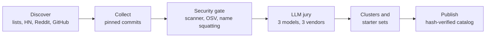

# Repotify in depth

The [README](../README.md) is the short version. This page has the details.

## How it works

1. **Knows your project without spending tokens.** A local script reads manifests and file names (never your code) and writes a ~400-token summary.
2. **Asks only what it cannot infer.** At most three multiple-choice questions, and only when the project does not already answer them.
3. **Picks from a vetted catalog, by evidence.** Every item passed a rule-based security gate (plus an OSV advisory check for pinned packages). Every skill is also scored by a three-model LLM jury from three vendor families; tools and MCP servers are editorial picks. Dependencies narrow broad needs, apps without a web target get no web-only skills, and an item joins the default set only if it covers something nothing else does.
4. **Lets your agent judge.** The agent reads a short candidate table (under 900 tokens), keeps the mandatory core, and writes one sentence per item: why it matters for *your* project.
5. **Installs safely.** Skill files come from a locked commit, are checked against catalog SHA-256 hashes, re-scanned on your machine, then written to your agent's folder and recorded in `repotify.lock.json`. Hooks and MCP servers change how your agent runs, so only you switch them on (`repotify enable`).

The whole flow costs your agent about 4,700 tokens.

## The v2 recommendation pipeline

Behind `recommend` (in `lib/pipeline/`) is a five-step pipeline that closes the loop — recommend → measure → learn:

1. **Test.** Every catalog candidate runs its own tests; failures and flaky results are recorded, not retried into silence.
2. **Classify.** The three-model jury scores each skill for quality, specificity and maintenance; scores sort items into capability classes, and only verified or caution items can be promoted (blocked items never are).
3. **Map.** A deterministic capability graph (a DAG, not a strict tree; multi-parent allowed) with "try this if that fails" fallback edges resolves each job to the right item, so nothing overlaps. A Jev decision model acts only as a signal inside classification and ranking — never as the sole decider.
4. **Narrow.** A question cascade: project signals first, learned preferences second, questions only when both are empty — ordered by information gain, at most three.
5. **Present.** A conflict-free skill set inside a context budget, with measured effectiveness scores where the fleet has earned them.

Then Repotify measures what happened: shown, installed, invoked, kept after 7/30 days, removed, voted. A LinUCB contextual bandit learns per-user rankings from those signals (accepted at a 200-round simulated regret ratio of 0.664 against a 0.80 bar), and a fleet policy blends anonymized measurements across developers into a shared prior — publish the proof, hide the recipe. An in-house evaluation harness (six arms: repotify, none, naive, jev, oracle, placebo; two-phase routing → task protocol) keeps the whole loop honest: series 3 measured must-include capture at 9/9 (100%, bar ≥ 85%) and zero breakage.

> [!NOTE]
> The v2 pipeline is wired into the `repotify recommend` command: demand from project signals, capability-graph fallbacks, `--blocked` list, fleet policy blending, opt-in Jev arbitration (`--arbitrate` / `REPOTIFY_JEV=1`), and Stage 0 propensity telemetry.

## Locked product decisions (8-question package, 2026-10-01)

Approved product decisions and where they are enforced in code:

- **R1 (DL-035).** Coarse classification (three-model jury + keyword overlap) plus seed context (manifest deps) is sufficient — no extra work.
- **R2 (DL-036).** An edge that was not exercised by a forcing test may never enter the capability graph. Enforced by `lib/pipeline/graph/loader.mjs` (`R2 violation` on `tested !== true` or a missing test reference), locked by `test/karar-r2.test.mjs`.
- **R4 (DL-037).** Usage signals (invoked, kept) never flow back into classification — they go to the bandit only (`oneShotLabel` → LinUCB). Classification stays jury + tests + seed context (`lib/pipeline/classify/index.mjs` has no usage-signal input).
- **R6 (DL-038).** `data/graph-seed.json` is a frozen seed (version 1). Edge promotion happens only through a forcing test plus the telemetry threshold.
- **Q5 (DL-039).** Taste profiles are project-scoped by default — every project gets its own profile. A user-global profile requires explicit opt-in. Consistent with the locked rule: never touch global installs.
- **DL-040.** The fleet taste-model turn-on threshold is deliberately NOT a fixed number; it will be set from Stage 0 telemetry data using offline policy evaluation (`lib/learn/ope.mjs`).
- **DL-041.** The leaderboard spec is approved: effectiveness is built from the one-shot label components (invoked, outcome, kept, removed, replaced), published with a 7-day delay, broken down by project type, reported as mean [min–max] with no stars or ratings.
- **DL-042.** Platform fallback weights for unobservable channels (e.g. `invoked`) are NOT fixed; they will be calibrated on Stage 0 data in the FAZ 11 OPE calibration harness. The locked rule stands: an unobserved channel is masked (recorded as unknown, never scored as 0).

## Security model

| Level | Meaning | What happens |
|---|---|---|
| `verified` | No known risky pattern | Recommended |
| `caution` | A finding worth a look | Shown with a badge, installed only with explicit consent |
| `quarantined` | High risk | Not recommended until a human reviews that exact commit |
| `rejected` | Critical risk | Removed from the catalog |

- A rule-based scanner decides trust. It reads shell commands the way a shell does (pipes, quotes, subshells, line continuations) and parses URLs the way curl does. It looks for remote code execution, credential access, data exfiltration, prompt injection aimed at agents or reviewers, hidden Unicode, obfuscated code, auto-running hooks, install scripts, destructive commands, binaries and symlinks.
- The LLM jury can only add suspicion, never raise trust.
- Third-party items are pinned to a commit and never update silently.
- Tools (for example Graphify) are never executed for you; Repotify shows the steps.
- Reports: [scanner results on real skills](reports/scan-corpus-report.md), [code reviews](reports/code-review-2026-09-28.md), [0.2.0 security review](reports/security-review-2026-09-30.md), [security audit](reports/security-audit.md). To report a problem, see [SECURITY.md](../.github/SECURITY.md).

## Supported agents

| Agent | Skills folder | MCP config |
|---|---|---|
| Claude Code | `.claude/skills/` | `.mcp.json` |
| Cursor | `.cursor/skills/` | `.cursor/mcp.json` |
| Codex | `.agents/skills/` | `.codex/config.toml` |
| Gemini CLI | `.gemini/skills/` | `.gemini/settings.json` |
| Any other agent | `.agents/skills/` | — |

The agent is detected automatically; override with `--agent claude-code,cursor,codex`.

## All commands

| Command | What it does |
|---|---|
| `repotify` | Installs the repotify skill for your agent and prints the project fingerprint |
| `repotify fingerprint` | Project summary (`--json` for machines) |
| `repotify questions` | Only the questions the fingerprint cannot answer |
| `repotify recommend` | Conflict-free candidate table (`--type`, `--needs`, `--priorities`, `--budget`, `--json`) |
| `repotify install <ids…> --yes` | Installs catalog skills; caution items also need `--accept-caution` |
| `repotify enable <ids…>` | Switches on a hook or MCP server after showing the change; for you, not your agent |
| `repotify audit` | Judges the skills already installed: keep, consider removing or remove, with the reason |
| `repotify suggest` | Offers your own skill or repository to the catalog: a pre-filled form, nothing is sent |
| `repotify remove <id>` | Removes something Repotify installed |
| `repotify update --check` | Lists catalog updates for what you installed; `--apply` installs scanned updates |
| `repotify scan <dir>` | Runs the security scanner on any skill folder |
| `repotify vote <id> up\|down` | Rates an item you installed (at most weekly) |
| `repotify telemetry status\|on\|off` | Anonymous usage signals, default-ON with a first-run notice; queued locally until you `sync`; kill switches: `telemetry off`, `REPOTIFY_TELEMETRY=0`, `DO_NOT_TRACK=1` |
| `repotify sync` | Sends an anonymous aggregate summary to the fleet server — only aggregates, and only after you confirm on the terminal |
| `repotify guard --self-test` | Checks the package guard; Claude Code runs `repotify guard --hook` itself |

## What Repotify changes on your machine

| Command | Writes |
|---|---|
| `repotify` | Your agent's `skills/repotify/` folder and `repotify.lock.json`; nothing else |
| `install` | Skill folders in your agent's skills directory, and the lock file |
| `enable` | Only what it shows you first: a hook in `.claude/settings.json` or an entry in your agent's MCP config |
| `recommend`, `audit`, `suggest`, `scan`, `fingerprint` | Nothing |

It reads manifests and file names, never your code. It downloads the catalog, and skill files at pinned commits;
tools are never executed for you. Repotify's flow never has your agent switch hooks or MCP servers on: `enable` asks
in a terminal (without one it needs `--yes`), and the skill tells agents to hand you the command instead of running it.
This is a guard rail, not a sandbox: your agent's own permission settings still decide what it may run.

## The mandatory core

Every project gets a small core that makes any agent more disciplined: a codebase knowledge graph (Graphify), the Superpowers discipline skills (brainstorming, writing plans, test-driven development, systematic debugging, verification before completion), a security review of every diff, and the **Repotify package guard**, which stops installs of packages that do not exist and asks before brand-new ones (a common attack on agents that invent package names). The guard is a hook, so you switch it on yourself with `repotify enable repotify-guard`.

## How the catalog is built



The maintainers rebuild the catalog through this pipeline, and your client always reads the newest one (ETag-cached, with an offline copy in the package and rollback protection). Installed third-party items stay locked until you approve a scanned update. The package ships a hand-picked starter catalog; discovered items join when the catalog is rebuilt.

## Privacy

Repotify learns from anonymous usage signals, and you stay in control.

- **Default-ON with a notice.** The first time anything could be recorded, the CLI prints this on stderr — nothing is measured before it:

  > Repotify measures which skills actually work and shares anonymous usage counts to improve recommendations. Turn off any time: `repotify telemetry off`.

- **Kill switches.** `repotify telemetry off` (persisted in config), `REPOTIFY_TELEMETRY=0`, `DO_NOT_TRACK=1` — and `NO_ANALYTICS=1` is honored too. When disabled, nothing is recorded and nothing is sent; the off command itself produces no telemetry.
- **What is measured.** A random install id, agent type, which catalog items were shown, installed, invoked, kept after 7/30 days or removed, and your votes. Events are validated as reward-agnostic: reward/score/weight fields are rejected, so the client can never fabricate outcomes.
- **What is never collected.** Code, prompts, transcripts, file names, repository names, user names, IP addresses. The server schema has no install_id, nonce or IP columns — this is locked by tests.
- **Fleet learning.** Signals stay in a local queue. Only `repotify sync` sends anything: anonymous aggregates, and only after you confirm on the terminal. The fleet server runs a nightly job (admit → snapshot → policy → gate → distribute) with k-anonymity (a skill's aggregate is published only when at least 5 distinct syncs contributed; 24-hour quarantine before counts influence public aggregates) and the public leaderboard stays gated behind 200 cumulative installs. Published is the proof — which skills measure best at which jobs — never the recipe: raw data, taste profiles, scoring formulas and bandit weights stay private.

## The website

The official site ([repotify.github.io/repotify](https://repotify.github.io/repotify/), built from `site/`) is 168 pages in 24 languages, generated statically with no trackers. Each catalog item gets a page with public comments (moderation controls only behind `?demo=moderation`, never on public pages). The [effectiveness leaderboard](https://repotify.github.io/repotify/leaderboard/) ranks routing strategies by measured harness evidence, reported as mean [min–max] — no stars, no ratings. A fleet effectiveness leaderboard stays behind a feature flag until the 200-install threshold is reached.

## Official sources

The only official repository is [github.com/repotify/repotify](https://github.com/repotify/repotify), and the website is
[repotify.github.io/repotify](https://repotify.github.io/repotify/) (built from `site/`). The npm package is published
as `@repotify/repotify` from this repository, with provenance; npm does not allow an unscoped `repotify` package.
Packages, forks or catalogs under other names are not affiliated; the agent block at the top of this page is the only
install instruction.

## Development

Node.js 18 or newer, zero dependencies.

```bash
npm test          # unit, integration and end-to-end tests
npm run eval      # recommendation quality on the scenario set
```

The catalog pipeline lives in `pipeline/`; how to run and review it is in [docs/guides/operations.md](guides/operations.md).

Test helpers are not tests: `test/learn-harness.mjs` is the shared FAZ 6 simulation harness imported by `test/learn-sim.test.mjs` (only `test/*.test.mjs` runs under `npm test`). `test/harness/` holds the eval/pilot runners; their generated outputs land in `test/harness/runs/` and are git-ignored (except `series3.jsonl`, which the site build loads as a data source), as is the agent working-state dir `hidden_files/`.
