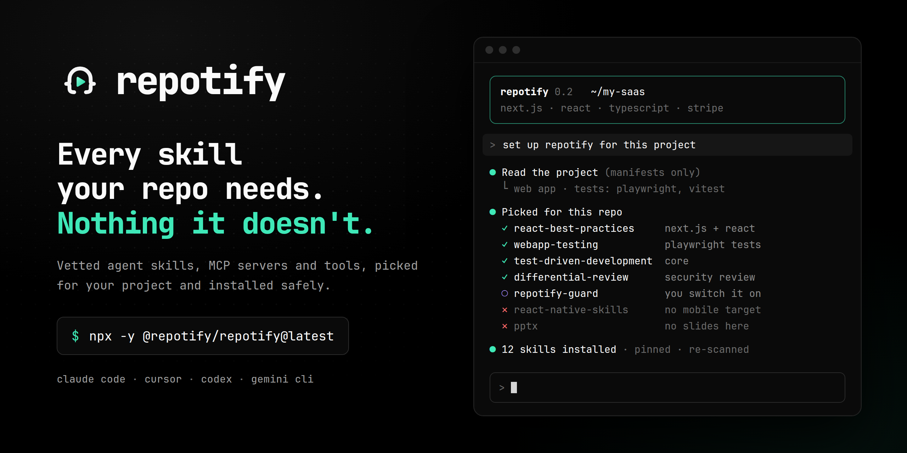
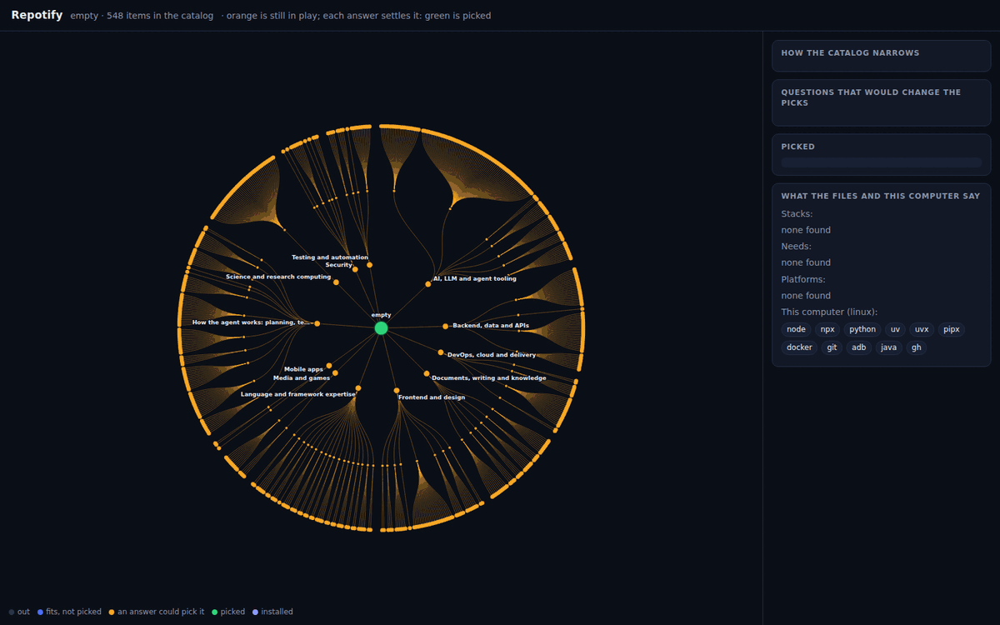

<p align="center"></p>

<h3 align="center">Binlerce ajan skill'i. Repona uygun olanlar.</h3>

<p align="center">Repotify, geliştiricilerin GitHub'da yayınladığı ajan skill'lerini bulur, her birini risklere karşı tarar<br>ve projen için en iyi seçimleri Claude Code, Cursor, Codex veya Gemini CLI'ye kurar.</p>

<p align="center"><a href="../../README.md">English</a> · <b>Türkçe</b> · <a href="README.zh-CN.md">简体中文</a></p>

## Başla

Proje klasöründe:

```bash
npx -y @repotify/repotify@latest
```

Ya da ajanına söyle: **"Bu proje için Repotify'ı kur: https://github.com/repotify/repotify"**

<p align="center"></p>

## Nasıl çalışır

1. **Okur.** Manifest dosyalarına, dosya adlarına ve bu bilgisayarda hangi çalışma ortamlarının kurulu olduğuna bakar. Kodun asla okunmaz, hiçbir yere gönderilmez.
2. **Sorar.** Yalnızca cevabı seçimleri değiştirecek soruları sorar: en fazla üç, çoğu zaman hiç. Her soru bir kez sorulur.
3. **Seçer.** Her iş için en iyi skill, MCP sunucusu veya aracı seçer. Katalogdaki her öğe güvenlik taramasından geçmiş ve bir karar modeli tarafından sınıflandırılmıştır. Taramadan gelen bir öğe, ancak insanların onu gerçekten kullandığına dair kanıt varsa varsayılan sete girer; yoksa alternatif olarak listelenir.
4. **Kurar.** Her skill sabitlenmiş bir commit'ten gelir, hash'i kontrol edilir ve senin bilgisayarında yeniden taranır. Kancalar ve MCP sunucuları sen açana kadar kapalı kalır.
5. **Takip eder.** İsteğe bağlı iki kanca, kurulumun ilk günden sonra da işe yaramasını sağlar: takipçi ve yönlendirici (aşağıda).

## Kararı gör

`repotify ui` kendi bilgisayarında bir sayfa açar ve kataloğu bir ağaç olarak çizer. Turuncu olanlar hâlâ oyundadır, yeşiller seçilmiştir; verdiğin her cevap bir dalı netleştirir ve sonunda yalnızca seçilenler kalır. Sayfa yalnızca okur; hiçbir şey kuramaz ya da değiştiremez.

<p align="center"></p>

## Kurulumdan sonra

- **Takipçi** (oturum başında çalışan bir kanca) projenin hangi teknolojileri ve ihtiyaçları gösterdiğini hatırlar. Yeni bir şey eklediğinde, örneğin bir ödeme kütüphanesi, ajanına bir kez hangi yeni seçimlerin uyduğunu söyler. Haftada bir de denetlenmiş güncellemelere ve artık yerini hak etmeyen skill'lere bakar.
- **Yönlendirici** (her istekten önce çalışan bir kanca) isteğin ne tür bir iş olduğunu anlar (hata, plan, inceleme, yavaş sorgu), o iş için yapılmış kurulu skill'lerin adını verir ve ajana bunlar hakkında karar vermesini söyler. Hiçbiri uymuyorsa hiçbir şey söylemez. Senin bilgisayarında, saniyenin onda biri kadar sürede çalışır ve ajanın bağlamına yalnızca skill adlarını yazar. İngilizce ve Türkçe istekleri anlar.

İkisini de sen açarsın: `repotify enable repotify-tracker repotify-router`.

## Katalog nasıl kurulur

Ajanlar skill'i tek satırlık açıklamasına bakarak seçer. Repotify önce skill'in tamamını ve insanların onun hakkında söylediklerini okur.

1. **Bulur.** Bir tarayıcı, bir reponun her skill klasörünü bir kez indirip içerik deposuna koyar: şu ana kadar 54 repodan 4.651 skill klasörü. MCP sunucuları resmi MCP kayıt defterinden gelir: 36.000'den fazla sunucunun 13.547'si npm ya da PyPI'den yerel olarak kurulabilir.
2. **Tarar.** Her dosya bir shell'in okuyacağı gibi okunur (gizli indirmeler, anahtar çalma, prompt enjeksiyonu). Bir MCP sunucusunda, kataloğun sabitlediği sürümün kurulum betikleri ve bilinen açıkları kontrol edilir; paketin bir sunucu başlatan komutu olmalıdır.
3. **Sınıflandırır.** Bir karar modeli ([Jev](https://openrouter.ai/docs/guides/community/jev)) her skill'in tam `SKILL.md` dosyasını okur ve soruları olasılıkla cevaplar: yazılım işi mi, tek ana işi ne, hangi dil, framework ya da ürün için, tek bir ürüne mi bağlı, ne amaçla yazılmış, bir kere mi her seferinde mi işe yarar, ne kadar iyi. Kurallar yalnızca emin cevaplarla hareket eder, gerisini bir insana bırakır. 49 elle etiketlenmiş skill'de: ana iş %88 doğru (bir jürinin serbest etiketleri: %52), dil %98 (%86), konu dışını yakalama %98 (%88).
4. **Araştırır.** Yıldız satın alınabilir; bu yüzden dört araştırma ajanı bir repo hakkında başka ne varsa onu okur: forum yazıları, yıldız geçmişi ile gerçek kurulum sayıları, dizinler ve seçki listeleri. Araştırılan 90 reponun 19'u şişirilmiş göründü; bunlardan üçünün skill'leri (471 skill) kataloğa girmek yerine bir insanın bakmasını bekliyor.
5. **Karar verir.** Kurallar bütün bunları ağ ve model çağrısı olmadan katalog öğelerine çevirir; bir kural değişince katalog, hiçbir şeyi yeniden indirmeden ya da sormadan saniyeler içinde yeniden kurulur. Taranan 431 skill ve 24 MCP sunucusu geçti; elle denetlenmiş 93 öğeye eklendiler. Taramadan gelen bir öğe varsayılan sete ancak gerçek kullanım kanıtıyla girer (kurulum sayısı, ya da indirme sayısı ve yıldız almış bir repo); diğerleri alternatif olarak listelenir.
6. **Seçer.** Projenin manifest dosyaları hangi işlerin gerektiğine karar verir. Her işe denetlenmiş tek öğe, bağlam bütçesi içinde; önce elle seçilenler. Zaten kurulu olanlar yerini korur.

Modeller katalog kurulurken çalışır; senin API anahtarına ya da model çağrısına ihtiyacın yoktur: `repotify recommend` deterministiktir ve çevrimdışı çalışır.

## Neden Repotify

- **Projene uyar.** Bağımlılıklarında Excel varsa tablo skill'i gelir, Word ve PowerPoint gelmez. Mobil uygulamaya sadece web'e özel skill'ler önerilmez.
- **Şüpheli hiçbir şey giremez.** Her skill bir shell'in ve curl'ün okuyacağı gibi okunur; gizli indirmeler, anahtar çalma ve prompt enjeksiyonu gibi bilinen hileler yakalanır.
- **Şişkinlik yok.** Her iş için bir öğe, bağlam bütçesi içinde. Ajanın hiç kullanmayacağı talimatları taşımaz, hızlı kalır.

## Kurulu olanları temizle

`repotify audit` projende zaten duran skill'lere bakar ve hangisini tutman, hangisini atman gerektiğini gerekçesiyle ve her birinin token maliyetiyle söyler. Ajanlarının ayarlı MCP sunucularını da okur: komutu güvenlik taramasından geçemeyen sunucu kaldırılmak üzere, sürümü sabitlenmemiş ya da ayar dosyasında gizli anahtar tutan sunucu gözden geçirilmek üzere işaretlenir. Hiçbir şeyi silmez.

Bazı skill'ler bir kere işe yarar: kod tabanı haritası ilk gün harikadır, sonra her oturumda açıklamasını, her tetiklendiğinde tüm talimatlarını yüklemeye devam eder. Sınıflandırıcı bunları işaretler (aday tablosunda ⏳) ve iki hafta sonra `audit` işini bitirdiğini söyler.

<p align="center"></p>

## Komutlar

| Komut | Ne yapar |
|---|---|
| `repotify` | Projeni okur ve ajanın için repotify skill'ini kurar |
| `repotify recommend` | Bu proje için seçimleri gösterir |
| `repotify questions` | Yalnızca cevabı seçimleri değiştirecek soruları listeler |
| `repotify ui` | Kararı yerel bir sayfada ağaç olarak çizer |
| `repotify install <id…> --yes` | Seçtiğin skill'leri kurar |
| `repotify enable <id>` | Bir kancayı veya MCP sunucusunu, değişikliği gösterdikten sonra açar |
| `repotify audit` | Zaten kurulu olan skill'leri ve MCP sunucularını değerlendirir |
| `repotify track` | Projede neyin değiştiğini ve hangi yeni seçimlerin uyduğunu söyler |
| `repotify suggest` | Kendi skill'ini kataloğa önerir |

**Claude Code**, **Cursor**, **Codex**, **Gemini CLI** ve `.agents/skills` okuyan her ajanla çalışır. Tüm komutlar, güvenlik modeli ve gizlilik: [docs/GUIDE.md](../GUIDE.md) (İngilizce).

## Yol haritası

- [x] Kurulu skill'lerin denetimi, kanıta dayalı seçimler, Linux, macOS ve Windows
- [x] Her skill bir karar modeliyle sınıflandırıldı: ana iş, dil, yaşam döngüsü, konu dışı kapısı
- [x] Bir kere işe yarayan skill'ler işini bitirince işaretlenir
- [x] Skill başına yorum yapılabilen web sitesi
- [x] Taramadan kurulan katalog: her skill bir kez indirilir, sınıflandırılır, yıldızlarının ötesinde araştırılır
- [x] Resmi kayıt defterinden, gerçek kullanıma göre seçilen MCP sunucuları
- [x] Yalnızca seçimleri değiştiren sorular; ağaç olarak çizilen karar (`repotify ui`)
- [x] Kurulumu güncel tutan ve ajanı uygun skill'e yönlendiren kancalar
- [ ] Binlerce repo üzerinde kesintisiz çalışan tarama
- [ ] Geliştiricilerin tuttuklarından ve kaldırdıklarından öğrenen sıralama (ölçüm ve öğrenen model hazır; toplama sunucusu henüz çalışmıyor)
- [ ] MCP modu: ajanın Repotify'ı bir araç olarak çağırır

## Katkı

Harika bir skill mi yazdın? Reposunda `repotify suggest` çalıştır. Hata ya da yanlış alarm mı buldun? [Issue aç](https://github.com/repotify/repotify/issues). Kod yazmak mı istiyorsun? [CONTRIBUTING.md](../../.github/CONTRIBUTING.md) ile başla.

---

<p align="center">⭐ Repotify ajanına yardımcı olduysa, bir yıldız başka geliştiricilerin de onu bulmasını sağlar.<br><sub>MIT lisansı · <a href="https://repotify.github.io/repotify/tr/">Web sitesi</a> · <a href="https://www.npmjs.com/package/@repotify/repotify">npm</a> · <a href="../../CHANGELOG.md">Değişiklikler</a> · <a href="../../.github/SECURITY.md">Güvenlik</a></sub></p>
